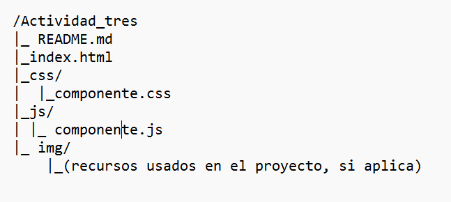
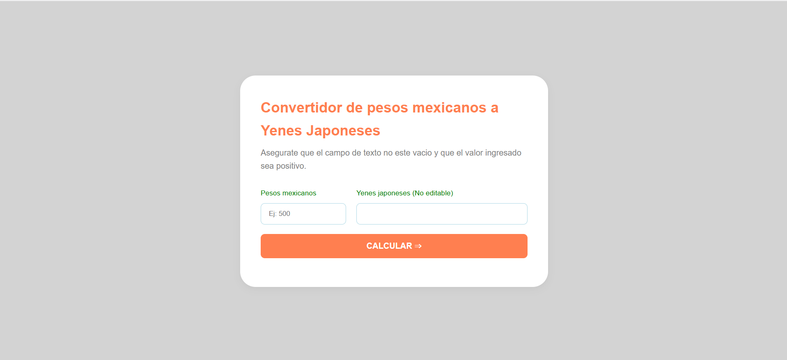
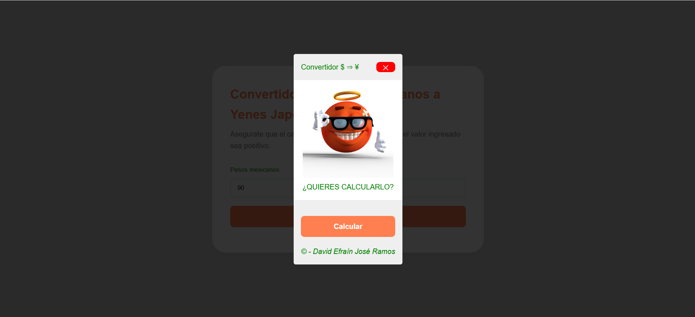
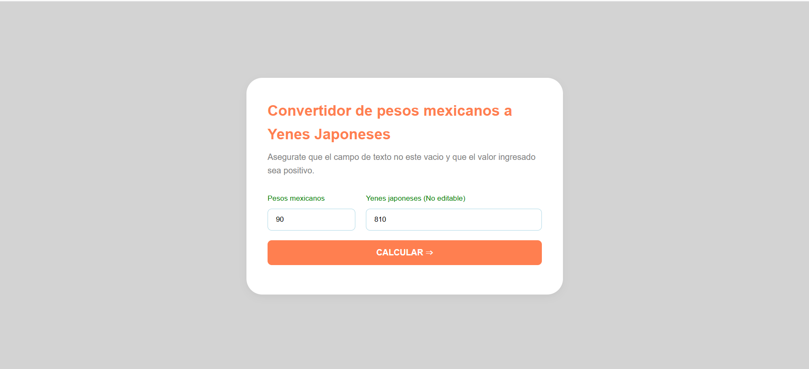

# Actividad tres - Mi segunda librería en JavaScript
## La librería se llama componente y mostrara un modal desde cero. 
Todo lo anterior se va a enlazar con un index y un login en GithubPages siguiendo la siguiente 
estructura:

***
#### Elaborado por: David Efraín José Ramos NL 19
## Problema que resuelvo
La problemática que se resuelve con una ventana modal es multifuncional desde avisos hasta ejecutar un formulario completo. Como la ventana modal esta hecha en javascript su principal ventaja es que se puede reutilizar editando únicamente el html.
***
### Instalación en un html con etiqueta 
Desde los metadatos llamamos a nuestro componente modal.
```html
		<script src = "js/componente.js" defer></script>
		<link rel = "stylesheet" href = "css/componente.css">
```
Lo utilizamos así: 
```html
				<button type="button" id = "button1" class="open-modal" data-open="modal1">
					CALCULAR ⇒
				</button>
```
Y lo modificamos así:
```html
				<div class="modal" id="modal1">
					<div class="modal-dialog">
						<header class="modal-header">
							Convertidor $ ⇒ ¥
							<button type = "button" id  = "button2" class="close-modal" aria-label="close modal" data-close>
								✕
							</button>
						</header>
						<section class="modal-content">
							
							<p>¿QUIERES CALCULARLO?</p>
						</section>
						<footer class="modal-footer">
							 <button type="button" id = "button3" onclick="Convertir()">Calcular</button>
							<p style = "text-align: center; margin-top: 19px;"><em>© - David Efraín José Ramos</em></p>
						</footer>
					</div>
```

Desde el javascript cerramos y abrimos el modal:
```js
/*<--- ABRIR EL MODAL CON EL BOTÓN --->*/

const openEls = document.querySelectorAll("[data-open]");
const isVisible = "is-visible";
for(const el of openEls) {
	el.addEventListener("click", function() {
		const modalId = this.dataset.open;
		document.getElementById(modalId).classList.add(isVisible);
	});
}

/*<--- SALIR DANDO UN CLICK EN LA X --->*/

const closeEls = document.querySelectorAll("[data-close]");
for (const el of closeEls) {
	el.addEventListener("click", function() {
		this.parentElement.parentElement.parentElement.classList.remove(isVisible);
	});
}

/*<--- SALIR PULSANDO CUALQUIER PARTE DE LA PANTALLA --->*/

document.addEventListener("click", e => {
	if (e.target == document.querySelector(".modal.is-visible")) {
		document.querySelector(".modal.is-visible").classList.remove(isVisible);
	}
});

/*<--- SALIR CON LA TECLA ESC --->*/

document.addEventListener("keyup", e => {
	if (e.key == "Escape" && document.querySelector(".modal.is-visible")) {
		document.querySelector(".modal.is-visible").classList.remove(isVisible);
	}
});
```
Lo demás es puro diseño en css.
### Captura de pantalla de los ejercicios en consola
Aquí utilice una prueba experimental de cuanto finalice todas las funciones. 




### LINK DE VIDEO EN DRIVE
